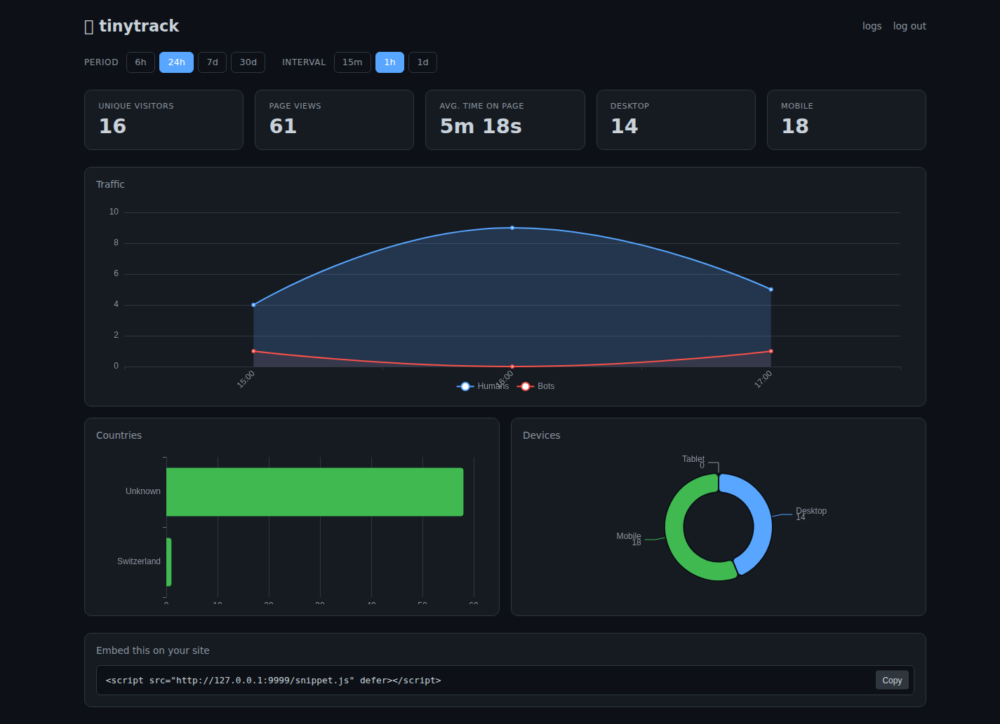
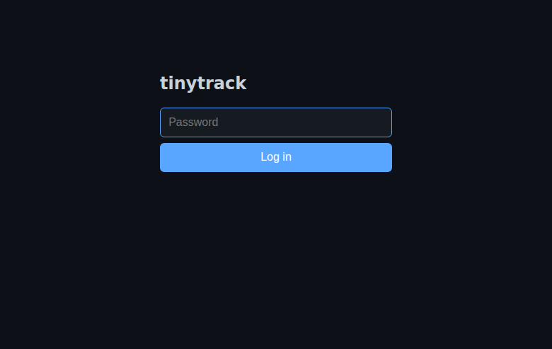
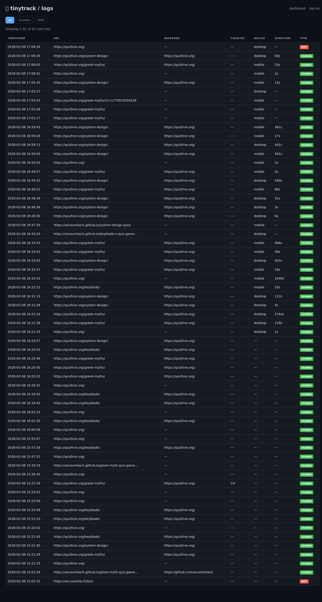

# tinytrack

Minimal, privacy-focused web analytics. Self-hosted, no cookies, no tracking IDs.



## Quick Start

```bash
# Install
uv tool install tinytrack

# Configure (create a .env file or set environment variables)
export TINYTRACK_PASSWORD="your-secret-password"
export TINYTRACK_SECRET_KEY="$(openssl rand -hex 32)"

# Run
tinytrack
```

Add this to your site:
```html
<script src="https://your-tinytrack-domain/snippet.js" defer></script>
```

That's it. View your dashboard at `http://localhost:8000/`.

### One-liner (no install)

```bash
uvx tinytrack
```

### From source

```bash
git clone https://github.com/zevaverbach/tinytrack.git
cd tinytrack
uv sync
uv run tinytrack
```

<details>
<summary>Using pip instead of uv</summary>

```bash
pip install tinytrack
tinytrack
```

Or from source:
```bash
git clone https://github.com/zevaverbach/tinytrack.git
cd tinytrack
python -m venv .venv && source .venv/bin/activate
pip install -e .
tinytrack
```
</details>

---

## Features

- **Privacy-first**: No cookies, no fingerprinting, no personal data stored
- **Lightweight**: Single Python file + templates
- **Bot filtering**: Automatic detection and separation of bot traffic
- **Time on page**: Tracks actual engagement, not just page loads
- **Geo & device breakdown**: See where your visitors come from and what they use
- **Dark mode UI**: Easy on the eyes

## Screenshots

<details>
<summary>Login</summary>


</details>

<details>
<summary>Logs view</summary>


</details>

## How It Works

1. **Visitor hits your page** → snippet.js fires a POST to `/t`
2. **Server hashes IP+UA** → creates anonymous visitor ID (never stored raw)
3. **On page leave** → beacon sends time-on-page to `/d`
4. **Dashboard** → aggregates and visualizes the data

No cookies. No localStorage. No tracking across sites.

## Configuration

| Variable | Default | Description |
|----------|---------|-------------|
| `TINYTRACK_PASSWORD` | `changeme` | Dashboard login password |
| `TINYTRACK_SECRET_KEY` | `change-this...` | Session signing key (generate a random string) |
| `TINYTRACK_ALLOWED_ORIGINS` | `[]` | Restrict tracking to specific domains (empty = allow all) |
| `TINYTRACK_DB_PATH` | `./tinytrack.db` | SQLite database location |
| `TINYTRACK_HOST` | `0.0.0.0` | Host to bind to |
| `TINYTRACK_PORT` | `8000` | Port to listen on |

## Deployment

### Systemd

```ini
[Unit]
Description=tinytrack
After=network.target

[Service]
User=www-data
WorkingDirectory=/opt/tinytrack
Environment="TINYTRACK_PASSWORD=your-password"
Environment="TINYTRACK_SECRET_KEY=your-secret-key"
ExecStart=/usr/local/bin/tinytrack
Restart=always

[Install]
WantedBy=multi-user.target
```

### Behind nginx

```nginx
location / {
    proxy_pass http://127.0.0.1:8000;
    proxy_set_header Host $host;
    proxy_set_header X-Forwarded-For $proxy_add_x_forwarded_for;
    proxy_set_header X-Forwarded-Proto $scheme;
}
```

### Cloudflare

tinytrack reads `cf-connecting-ip` and `cf-ipcountry` headers automatically for accurate geo and IP data behind Cloudflare.

## CLI Options

```
tinytrack [OPTIONS]

Options:
  --host TEXT     Host to bind to [default: 0.0.0.0]
  --port INTEGER  Port to listen on [default: 8000]
  --help          Show this message and exit
```

## API

| Endpoint | Method | Description |
|----------|--------|-------------|
| `/t` | POST | Record a pageview |
| `/d` | POST | Update time-on-page |
| `/snippet.js` | GET | Tracking script |
| `/` | GET | Dashboard (auth required) |
| `/logs` | GET | Raw logs view (auth required) |

## License

MIT
